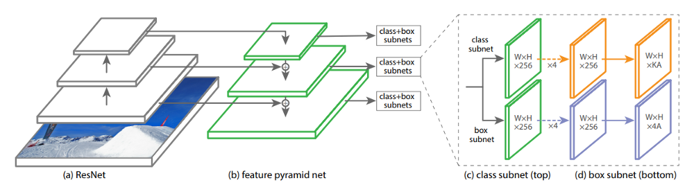

# ElectiveInAI-Module1-project

Project folder for Elective in AI 1, held by prof. Fiora Pirri at Sapienza Università di Roma

This project has the aim of implement a code that utilize the Keras Retinanet with 2 different datasets. 
- First assignment is to run the network on one of the default datasets and find the weights
- Second assignment is to run the network on the AVA dataset and find the error

In the [report pdf file](Project_Report.pdf) you can find a detailed description of the work done, with explainations on the procedure, the implementation choices and the results 

Drive links to the heavy model files are provided below:

- Keras Retinanet trained on pascal VOC2007 - 14 epochs : https://drive.google.com/file/d/1mWJRmjI56Rg_ev7mRQCGu6SPXG80_oXS/view?usp=sharing
